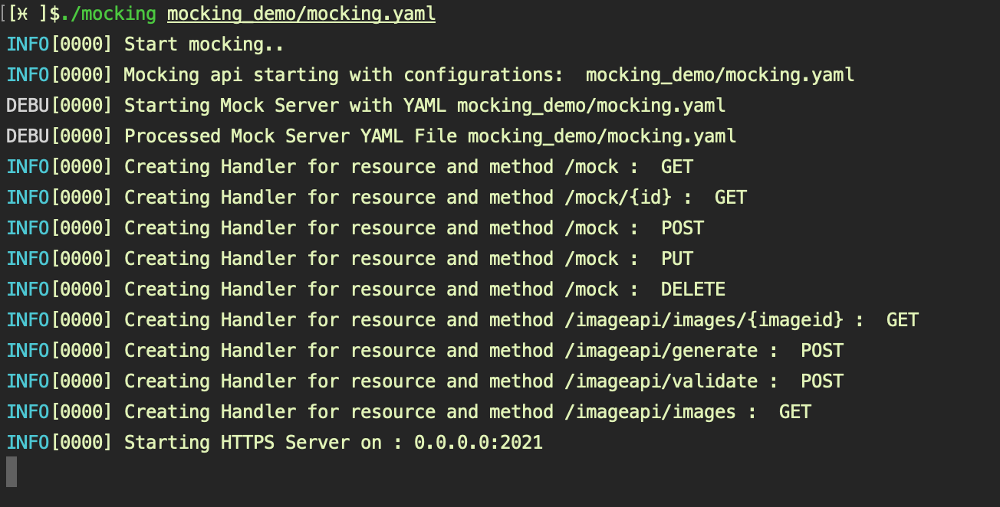

# Mocking API Server

## Starting Mock API Server

./mocking [path to mocking configuration yaml]

e.g. -  ./mocking mocking_demo/mocking.yaml

This now exposes mock responses for https://localhost:2021/mock and https://localhost:2021/imageapi based on the mocking_demo/mocking.yaml configuration

## Configuration Files

1. mocking.yaml

    This configuration file configures mocking api server and tells the mocking api where to find mock configurations for mocking responses.

    The file can be named anything as long as it is valid yaml with configurations listed below.

        version: (Required) This should be set to 0.1 for now.

        name: (Required) Name for mocking api server e.g. MockingServer

        port: (Required) Port that will be used for running mocking api server, e.g. 2021

        loglevel: (Required) Logging level, e.g. INFO, other values include DEBUG, WARN, ERROR

        https: (Optional) If using https, specify https option and certificate files. If not using https this option can be ignored.

        certfile: (Required when https) This is the TLS certificate file,  e.g. ./mocking_demo/certificates/mockingServer.crt
  
        certkeyfile: (Required) This is TLS certificate key file,  e.g. ./mocking_demo/certificates/mockingServer.key

        mockfoldersfiles: (Required) List of folder to find mocks that mock server will use to serve mock responses.
        both folder containing mock.yaml files or a mock.yaml file can be specified.
           
            e.g. 
                 - ./mocking_demo/demo_mocks1
                 - ./mocking_demo/demo_mocks1
                 - ./mocking_demo/demo_mocks3
                 - ./mocking_demo/demo_mock.yaml 

2. mocks.yaml

    This configures mock responses that will be served by mocking api server.

    Multiple mock files can be specified for mocking api server. The combination of Resource + Path + Method must be unique, any duplicates will be ignored by mocking api server. Multiple responses can be specified for Resource + Path + Method combination which will be iterated through sequentially.

    The mock configuration is specified in yaml and can be named anything as long as it is valid yaml and consists of following settings.

        mockversion: (Required) This should be set to 0.1

        name: (Required) Name for the mock , can be any string example:- Mock Demo

        resource: (Required) The resource that is being mocked example: /mock , so the mock URI would consists of http(s)://<SERVER>:<PORT>/mock

        mocks: (Required) This will contain collections of mock, each mock resprsents path and method that will be mocked and mock responses it will serve.

        mock: (Required) This is a mock for a unique combination of Resource + Path + Method. Each mock is made up of request and collection of responses.

        request: (Required)  This is the mock request which will be handled by mocking api server which is made up of path and method.
        
        path: (Optional) This is any path under resource defined for mock at the global level, if the path is not specified global resource will be used else path will be appended to the global resource to make up resource + "/" + path

        method: (Required) This is request method that will be handled by mocking api server.

        responses: (Required) This contains collection of response that will be mocked for given request. When more than one responses are available, then will be served sequentially on each invocation.

        response: (Required) This is the mock response made up of headers, status, body, file, delay, skipevery.

        headers: (Optional), headers to be mocked specified as "key : value"

        status: (Required), status code for the response.

        body: (Optional)  mock response body

        file: (Optional)  mock response file, either body or file is required.

        delay: (Optional) stall the response for configured time.

        skipevery: (Optional) serves this response every x number of times, 0 will skip this request.
