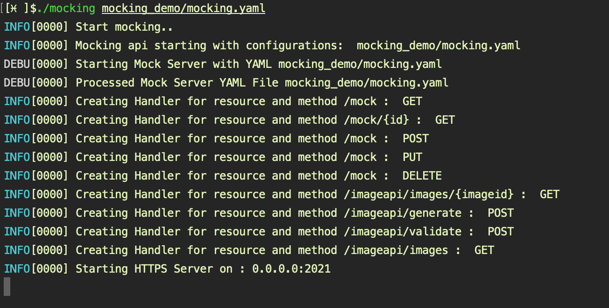

# Mocking APIs

Mocking for End to End testing, Simple Http/Https mocking server for end to end testing implemented in Go.Simple service to easily get started with mocking for end to end testing and development.

## TL;DR

Mocking API Server - Simple service to easily get started with mocking for end to end testing and development implemented in Go.

## Unit Testing

Test Driven Development emphasizes starting with test cases first, writing a failing test and then implementation to make the test pass, we continue working our way up following the “red/green/refactor” mantra building on our implementation.

All is well until we hit a wall interacting with external system or an external api we do not control, Mocks to the rescue. We can easily mock stubs to simulate required cases and  continue implementation accounting behavior of the external system.

There are plethoras of mocking frameworks available to assist us in our Unit Testing and make for a solid implementation. All of this helps with Unit testing which is very important and constitutes the must have basic unit for testing and good code.

## End to End Testing

What about mocking for end to end testing ?

Given a scenario, we want to do end to end testing for our super feature microservice, we depend on other microservices but not all of them are fully functional yet just some of them. We have the following options

- Let use cases depending on missing services conditionally fail

- Maybe other service team provides some stubs or maybe they did not get time to get to that yet and we ma need to mock their services for our end to end testing.

Wouldn’t it be nice to have some mocking support for end to end testing with minimum configuration ?

[Postman Mock Servers](https://learning.postman.com/docs/designing-and-developing-your-api/mocking-data/setting-up-mock/ "Postman Mock Servers") and [Mock Server](https://www.mock-server.com "Mock Server") provide mocking for end to end test.

Postman and Mock Server are excellent mature solutions and should be leveraged where needed, Both of these require fair bit of configuration to get started though.

Maybe one needs something much simpler, a simple http service up and running that returns predefined responses. Mocking API Server to the rescue.

## Mocking API Server

This is a simple HTTP/HTTPS service that can return mock response and can get up and running very easily, only work needed is to configure responses one expects and start mocking api server.

Point Application to Mocking API Server:

Validate Responses in Postman:

### Mocking API Server Implementation

Mocking API Server is a simple http service implementation in golang that wraps the [Gorilla](https://github.com/gorilla/mux "Gorilla") HTTP request multiplexer. The implementation reads mock configuration files and registers handlers for each unique route. The handler then turns around to return the configured mock responses for the routes.

Code: [Mocking API Server](https://github.com/MalcolmPereira/mocking "Mocking API Server")

Documentation: [Mocking API Server Documentation](https://github.com/MalcolmPereira/mocking/blob/main/MockingDocumentation.md "Mocking API Server Documentation")

Happy Mocking....
